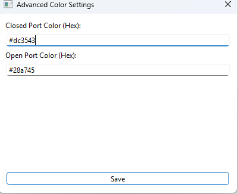

# Python Portscanner

This is a simple nmap ui for nmap port scanning. It requires nmap installed to work.
There are two versions of the program gui and cli.

Program currently works only on Windows but will have linux version in the future.

***Launcher is work in progges so it doesnt work***

## GUI 
This section describes the features of the GUI version of the app.
### Basics 
You can launch the Gui by running gui.py. To start the scan you must provide the targets IP address and starting and ending ports and press run.
e.g. 
 

After pressing the run button the output will be displayed on the right side of the app's window. It will look something like this: 

### OS Scanning
To run the nmap scan with OS detection check the "Enable OS Scan" checkbox 
e.g. 

### Settings
When you click the settings tab you can  change some features like location to your nmap files or the light and dark mode. You can press save to save your changes, they will be stored in data/user/user_settings.json file.  

<table>
<tr>
<td>Dark Mode</td>
<td>Light mode</td>
</tr>
<tr>
<td>

</td>
<td>

</td>
</tr>
</table>

### Advanced settings 

In advanced settings you can change the background color of the open ports and closed ports by providing hex values. 

## CLI

Cli version works the same way as the gui version just without the colors and settings. 

